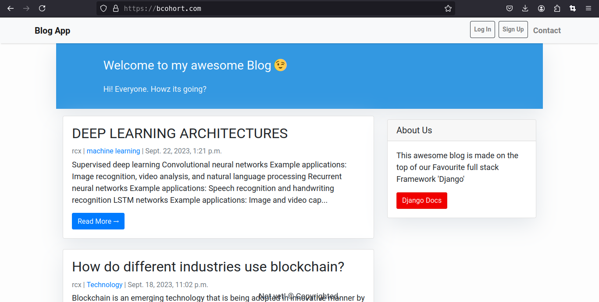
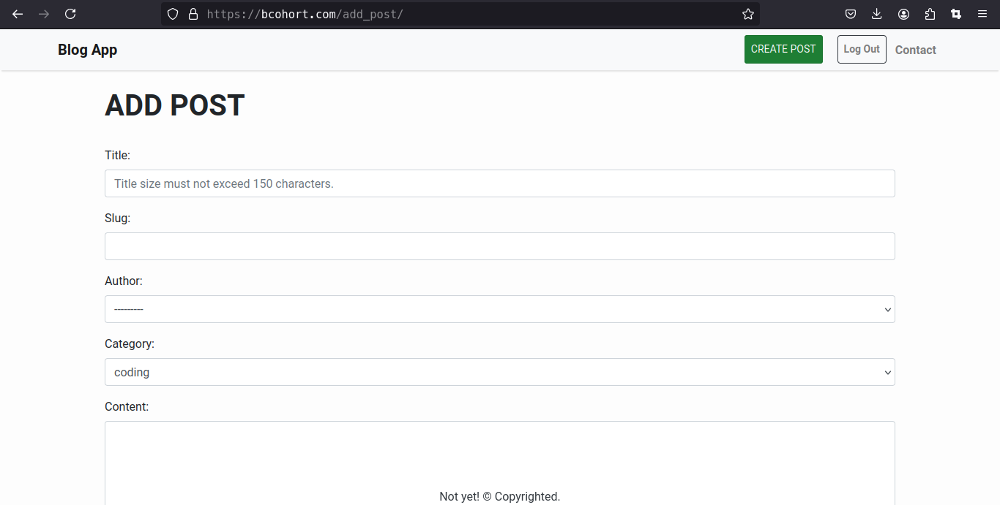
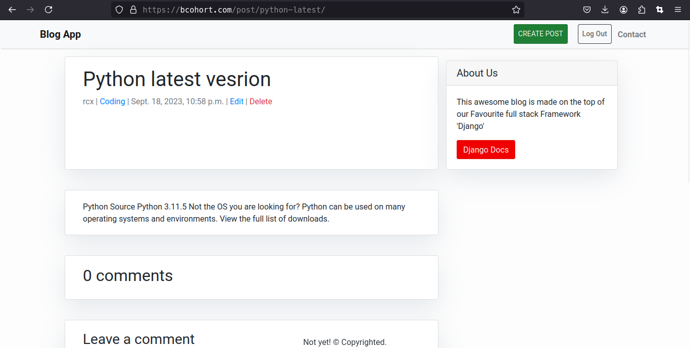
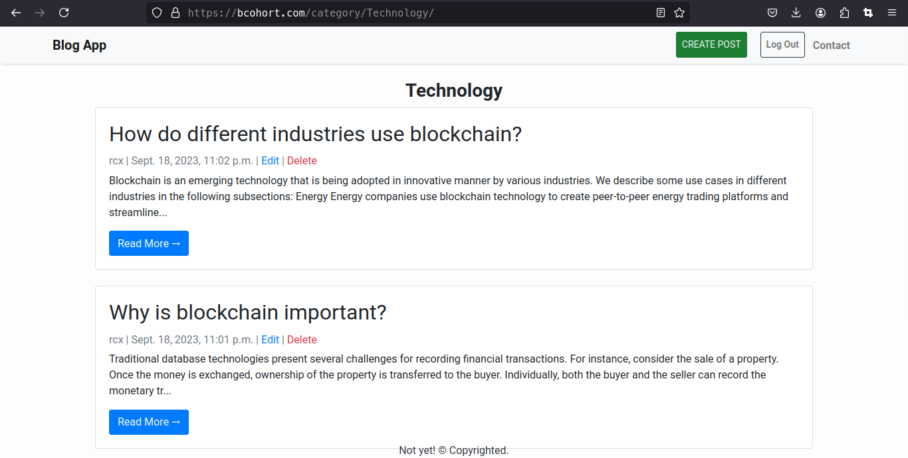

# learnDjango 🌐

## 🛠️ **Project Setup**

This guide will walk you through configuring MySQL as your database using a secure `.cnf` file for sensitive credentials.

### **Step 1: Add MySQL Configuration File**

- Create a `.cnf` file that contains the necessary database connection information. 

#### **Sample `my.cnf` File Format**:

```ini
[client]
database = DB_NAME
host = localhost
user = DB_USER
password = DB_PASSWORD
default-character-set = utf8
```

> ⚠️ **Note:** Never hardcode personal or sensitive information in your project's codebase. Use the `.cnf` file to protect your credentials.

---

### **Step 2: Update `settings.py` to Include `.cnf` File**

In your Django project's `settings.py`, update the `DATABASES` configuration to use the `.cnf` file for database credentials:

```python
DATABASES = {
    'default': {
        'ENGINE': 'django.db.backends.mysql',
        'OPTIONS': {
            'read_default_file': '/path/to/my.cnf',
        },
    }
}
```

- Replace `/path/to/my.cnf` with the actual file path to your `.cnf` file.

---

## 📸 **Screenshots**

<div align="center">
  
  
  
  
</div>

---

## 🤝 **Contributing**

- Fork this repository
- Create a new branch: `git checkout -b feature/<branch_name>`
- Commit your changes: `git commit -m '<commit_message>'`
- Push to the branch: `git push origin feature/<branch_name>`
- Open a pull request

---
